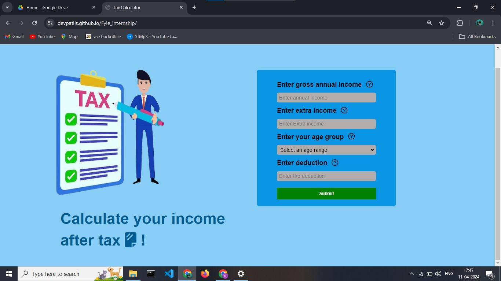
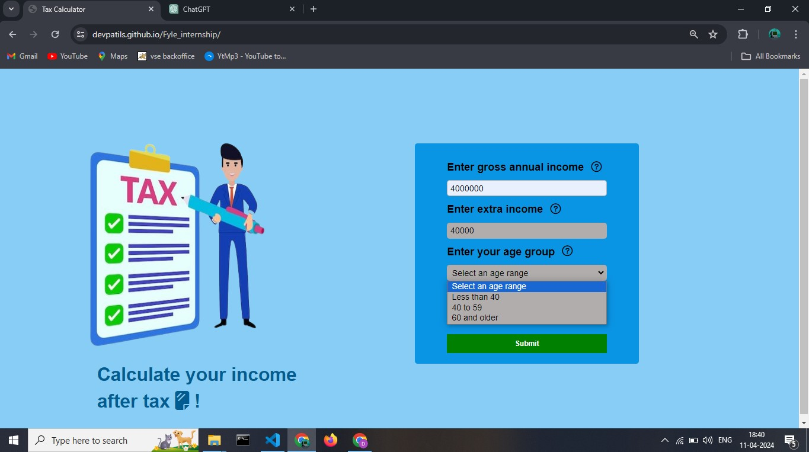
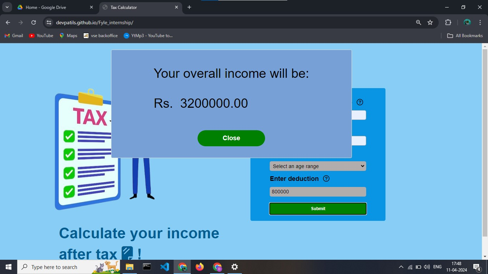
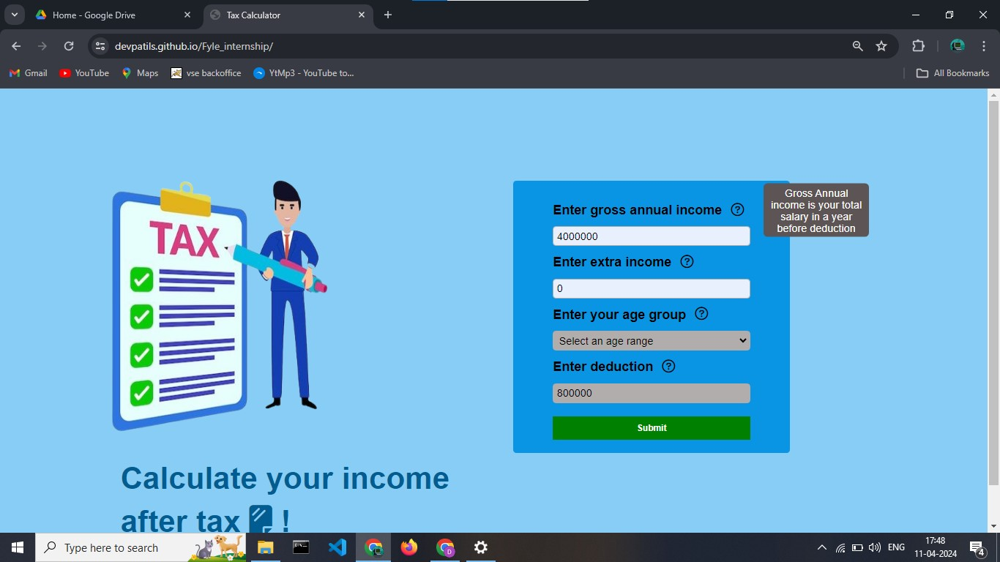
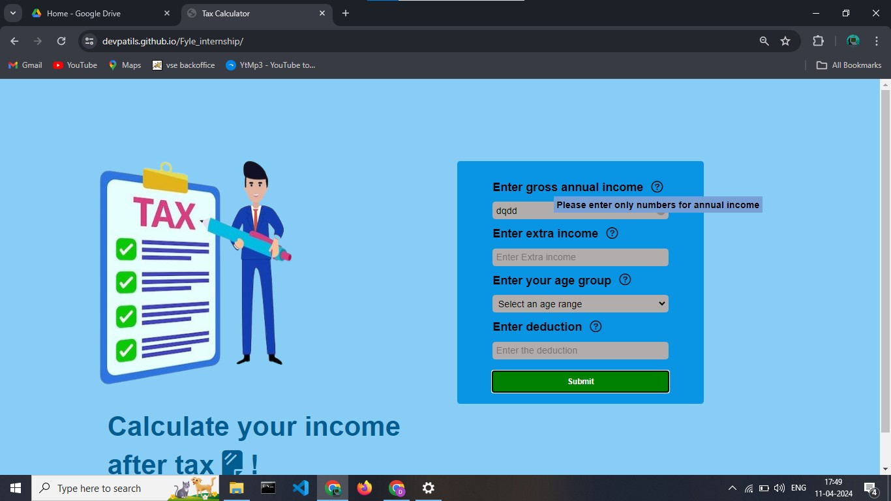
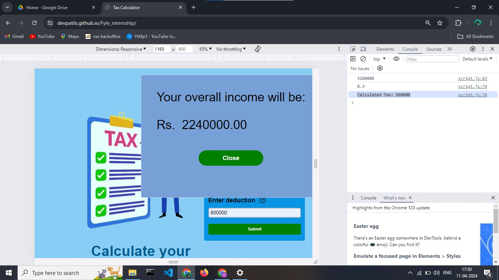

# Fyle_internship
<h3>Dev Patil</h3>
<h3>Flye internship Assignment</h3>

I have completed this assignment in 2 day on date 11/04/2024  as I recived it on 10/04/2024

<h4>How can you run on your local System :</h4>

<b>1. <b>Clone the repo in your local system 

<b>2. <b>Run the index.html file on your local system 

<b> Here are the links<b> 

<h5>Hosted Web App</h5>

<link>https://devpatils.github.io/Fyle_internship/</link>

<h5>ScreenShots : </h5>
 <h4>Landing Page:</h4> 

 <h4>Showing ages menu:</h4> 

 <h4>Income showing window:</h4> 

 <h4>Hovering on question mark (?):</h4> 

 <h4>Getting a (i) button on wrong input:</h4> 

 <h4>Logging the tax in console:</h4> 
